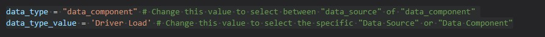
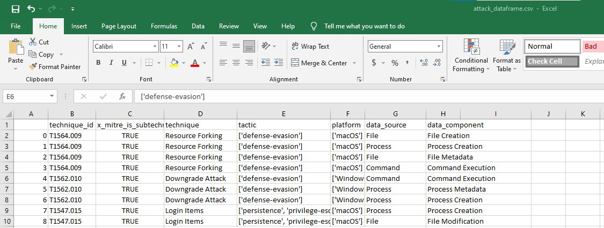
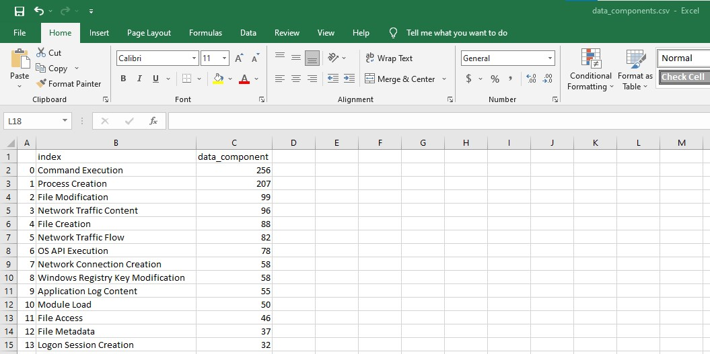
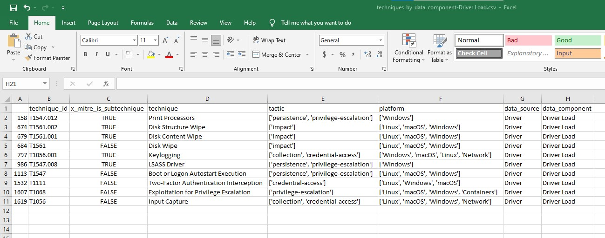
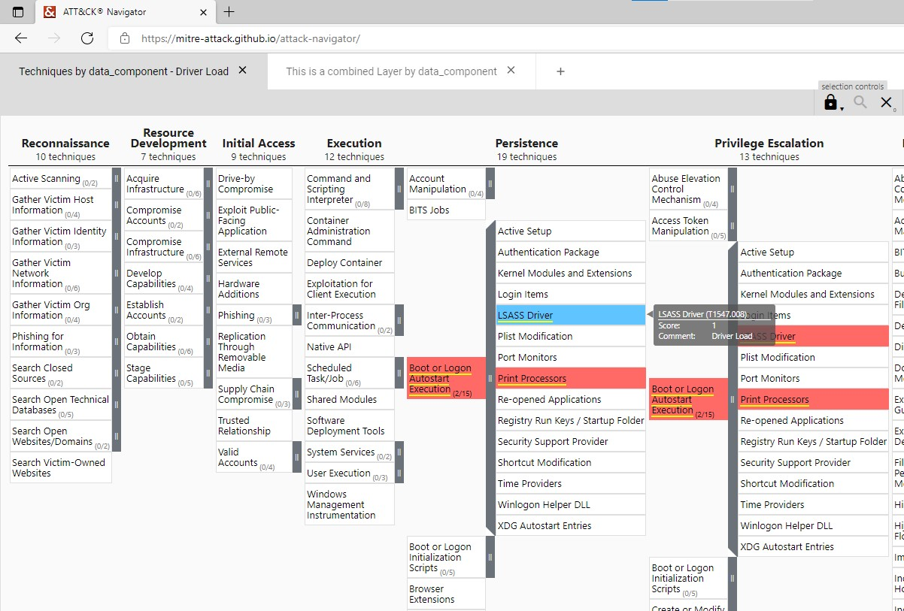
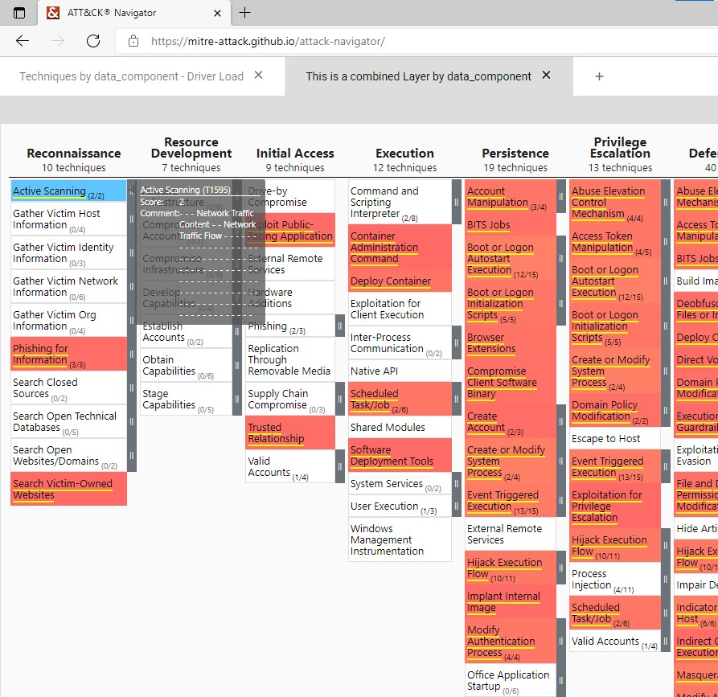

# mitre

This is the result of a small initiative that allowed me to get to know the Mitre Att&ck Framework and also allowed me to learn how to programatically interact with it.

The main goal of this initiative was to find a way to visualize the different Data-Sources and Data-Components present in each one of the techniques & sub-techniques of the Migre Att&ck Framework. This information comes in handy when trying to identify what Security Controls can be put in place to Detect a particular technique being used by an attacker.

The end product of this initiative is a Jupiter Notebook that allows the user to interact with the Mitre Att&ck Framework (specifically with Data-Sources and Data-Components). The notebook allows the user to generate csv files and navigator layer files (json) that can be used to visualize the desired information.

## Considerations
1. This code uses libraries from a public repo https://github.com/Cyb3rPandaH/attack-datasources developed by Jose Rodriguez (@Cyb3rPandaH). This libraries allow us to interact with up-to-date ATT&CK content available in STIX format via public TAXII server.
2. This code uses libraries from a public repo https://github.com/mitre-attack/mitreattack-python/tree/master/mitreattack/navlayers developed by Mitre. This libraries allow us to create navigator layer files (json) with the desired information.
3. Att&ck navigator version 4.2 was used as a parameter when creating Navigator Layers 
4. Att&ck Framework version 9.1 was used as a parameter when creating Navigator Layers

### Running the set up functions
This notebook task does three things:
1. Initiate the functions by Jose Rodriguez to:
- Import ATT&CK content as a list of dictionaries (from public TAXII server).
- Get a dataframe with current data sources per (sub)technique for the WINDOWS platform within the enterprise matrix.

2. Initiate the functions by Storo to:
- Allow us to do the desired filtering
- Allow us to create the desired navigator layers.

3. Sets up the two below variables:
- data_type - Change this value to select between "data_source" of "data_component"
- data_type_value - Change this value to select the specific "Data Source" or "Data Component"

### Getting the Attack Data Frame
This notebook task does two things:
1. Creates a Data Frame with current data sources per (sub)technique for the WINDOWS platform within the enterprise matrix.
2. Creates a csv file with the contents of this data frame:

### Getting the list of Data Types (Data Sources or Data Components) - (to CSV)
This notebook task does two things:
1. Creates a list of all available items per selected Data Type (Data Sources or Data Components)
2. Creates a csv file with the contents of this list:

### Techniques by Data Type - Specific Value (to CSV)
This notebook task does two things:
1. Creates a list of all available techniques per selected Data Type (Data Sources or Data Components) - Specific Value
2. Creates a csv file with the contents of this list:

### Creating a Customized Navigator Layer (for a Specific Data Type Value)
This notebook task creates a Navigator Layer of all available techniques per selected Data Type (Data Sources or Data Components) - Specific Value:

### Creating a Combined Navigator Layer by Data Type (Data Source or Data Component)
This notebook task creates a Combined Navigator Layer by Data Type (Data Source or Data Component):

